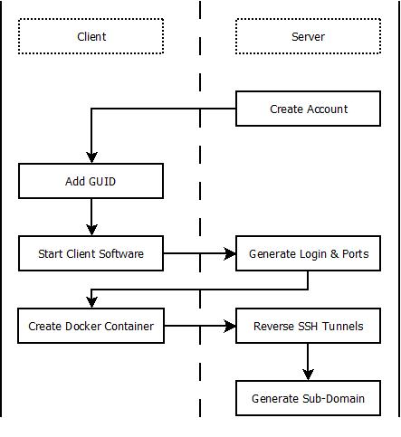

# Overview #
This document contains a high-level technical overview of the P2P VPS suit of
software. The full suit consists of a set of server, client, and server deployment software.

**The client software** has two targets: Raspberry Pi minicomputers and VirtualBox
VMs running Ubuntu Linux. The client software can be adapted to operate on
any device that is capable of running Docker. The focus of the client software is to:
* Create a basic Linux environment with a command line interface (CLI).
* Establish a reverse SSH connection with the server, to provide the CLI to the renter.
* Establish a [LocalTunnel](https://github.com/localtunnel/localtunnel) connection
to the server so the device can serve webpages, web apps, and distributed apps
(dapps), accessible from the general internet.

<small>
  * [Client Repository](https://github.com/P2PVPS/p2pvps-client)
</small>

**The server software** is composed of a Vue.js-based front end and a
[back end API](https://github.com/christroutner/babel-free-koa2-api-boilerplate)
running Node.js, MongoDB.
The user interface (UI) gives *Device Owners* a dashboard for managing the
devices they rent out on the marketplace.
It also gives prospective *Renters* an easy way to filter VPSs by benchmarks,
in order to find the
best price for their desired use. It's primary functions are:
* Register incoming connections from client devices.
* Negotiate the ports used in the reverse-SSH connection.
* Create listing on the OpenBazaar network to allow Client devices to be rented.
* Establish connection with other servers.

<small>
  * [Front End Repository](https://github.com/P2PVPS/p2pvps-dashboard2)
  * [Back End Repository](https://github.com/P2PVPS/p2pvps-server2)
</small>

**The server deployment software** is a collection of Dockerized packages,
all orchestrated with Docker Compose. This software is targeted for cloud
VPS hosts like Digital Ocean, Vultr, AWS EC2, etc running Ubuntu Linux. The
major components consist of:
* [Koa API Server](https://github.com/P2PVPS/p2pvps-server2).
* A MongoDB instance for managing data.
* An [OpenBazaar](http://openbazaar.org) instance for conducting rental transactions.
* A [Listing Manager](https://github.com/P2PVPS/listing-manager) that maintains
the OpenBazaar store inventory and fulfills transactions.
* An SSH server for managing reverse SSH tunnel connections.
* A [LocalTunnel](https://github.com/localtunnel/localtunnel) server for
managing the networking of HTTP (port 80) and HTTPS (port 443) connections.

## Definitions
* *Client* or *Device* includes IoT devices, servers, and anything in between.
This term encompasses any device capable of running Docker and executing the
[client software](https://github.com/P2PVPS/p2pvps-client)
* *Server* is an internet connected computer capable of running the software in this repository.
* *Device Owners* are the owners of the Client devices.
* *Renters* are users who rent the Client device from the Device Owners.

A simple diagram of a P2P VPS Marketplace:

## Client-Overview
The purpose of the client side software is to create a virtual private server
(**VPS**) environment similar to those hosted by cloud companies like Digital
Ocean or AWS EC2. This is achieved on an IoT device by running a Linux shell inside
a Docker container. Small, inexpensive, distributed hardware like Raspberry Pi
minicomputers now posses the computational power to host such an environment.

This setup has the following advantages:

* By running the environment in a virtual system like Docker, the device can be easily reset to a known state
when the *renter* is done using it.

* By using reverse SSH to connect to a central server, the *renters* can be provided with a command line interface to the device while
by-passing network firewalls. However, this creates network risks that device *owners* need to be aware of.

* Renting out the computing power of the hardware allows hardware *owners* to profit from their hardware and internet connection, while promoting a decentralized internet.

* Creating distributed, semi-anonymouse VPS micro-servers, hosted in peoples homes,
has empowering legal ramifications and moves the internet towards a more reliable,
distributed, and censorless architecture.

The client software is composed of the following high-level features. Each feature needs a manager, so if you are
interested in contributing, [please let us know](http://p2pvps.org):

* Governor
* Docker container with SSH
* Persistent Storage
  * Encryption
* Deployment Packages (pre-configured scripts for setting up apps like webservers, file sharing, etc.)

See more details in the Client section.

## Server-Overview
The primary purpose of the server software is to orchestrate the network of devices
and facilitate financial transactions via OpenBazaar.
Its secondary purpose is to connect with other servers, in order to establish a
peer-to-peer (P2P) marketplace, with no central point of failure. These goals are achieved by splitting the server into two software stacks: The *front end* and the *back end*.

**The front end** of the server has to do will all the activity that takes place
in a web browser. It's primarily concerned with the Vue.js applications that allow
renters and owners to manage devices. It is composed of the following high-level
features:

* Rental Search - searching and filtering rental devices.
* Device Management Dashboard - allowing device owners to manage their devices on the network.

**The back end** of the server is primarily concerned with the database and REST APIs
used to coordinate the different pieces of software in the P2P VPS suite.
It is composed of the following high level features:

* Database API
* Website and Content Management System (CMS)
* Port Control

## Server-Deployment-Overview
The Server Deployment repository is primarily concerned with helping people start up
their own P2P VPS marketplace by easily deploying the software onto a Linux cloud
server. This is accomplished by modularizing the major pieces of software into Docker
containers and then orchestrating their communication with Docker Compose. It is
made up of the following high level features:

* ConnextCMS
* MongoDB
* OpenBazaar
* Listing Manager
* SSH Server
* LocalTunnel
* Nginx Configuration

## High-Level-Workflow
The sections below give additional details on how the system-as-a-whole works.
Lower level specifications will be captured in the respective specification
document for Client, Server, and Server Deployment.

### Network Orchestration
A client device registers with a server by making a REST API call and passing a
server-generated key (GUID). Upon receiving a valid registration call, the server
opens new ports, generates login details, and returns this information to the client.
The client then launches a Docker container with a minimal Linux environment.
The container makes a reverse SSH connection to forward its local SSH port to the
server's new port, tunneling through any firewalls, and creating a command line
interface accessible to the renter.

The Server operates a minimal SSH server running inside a Docker container and
another [LocalTunnel server](https://github.com/localtunnel/server)
running inside it's own Docker container. This SSH shell allows connection to the
client device via SSH. The LocalTunnel server also forwards port 80 (http) and
port 443 (https) from the client device. A subdomain is created
on the server allowing access to these three ports. This allows renters to
connect to the command line on the client device and also
serve web pages and web apps from a human-readable URL.

### Financial Transactions
Transactions between Owners and Renters will take place over the
[OpenBazaar](http://openbazaar.org/) (**OB**) network.
This requires that the buyer and seller each have a local installation of
OpenBazaar capable of sending a receiving cryptocurrency. Cryptocurrencies have the
advantage of allowing server owners to create semi-anonymous markets. It also
allows P2P VPS servers to facilitate trade between Owners and Renters without
having any liability with regard to financial transactions.

Rental of devices will be billed by the hour.
When a device is registered, its hardware (memory, CPU, hard-drive space) will be verified.
Owners can then place the device for rent on the P2P VPS marketplace, or simply
reserve it for personal use.
The device owner can set the hourly rate they are willing to rent the device for
on the marketplace.

A renter agrees to the rental contract by purchasing the contract on the
OpenBazaar network for a fixed length of time.
The listing for the device is then removed from the P2P VPS OpenBazaar store.
A random username and password generated for the device is sent to the renter
along with the receipt for the transaction, inside the OB client.

As long as the device is connected to the internet, the device
will be dedicated for the renters use. Once the length of the contract expires,
the client device is reset and placed back on the marketplace.

In the future, a feature will be developed to allow renters to extend the length
of their contract. If the client device goes offline and can not fulfill the
terms of the contract, an OpenBazaar dispute is activated and a moderator can
pro-rate and refund part of the transaction to the renter.
At the moment, dispute resolution is a manual process, but it will be automated
in the future.

At some regular interval, typically a month, it is up to the Server owner to distribute
earned money to the Device Owners. An API for the server will be provided to query
all payments owed to Device Owners. Payment will be most easily facilitated if the
Device Owners have OpenBazaar wallets, as that is the same wallet that Clients and the
Server will use. It is up to the Server owner and Device Owners to negotiate costs
and fees.

### Federated Servers
Server software will be able to establish connections with other servers at the
desire of the server administrator.
This API will allow P2P VPS servers to link to one another. The link will appear
on their website. A link to the servers OpenBazaar store
will also appear on their OpenBazaar store page.
By creating a federation of marketplaces, the overall network has no single
point of failure. If a server goes down, Device Owners can simply move their devices
to other servers.

