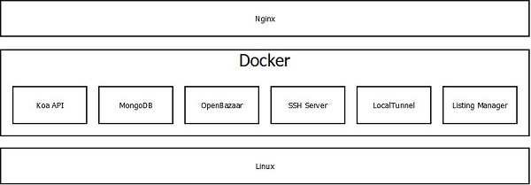

# Server Deployment
The server deployment software is a collection of Dockerized packages, all orchestrated
with Docker Compose. This software is targeted for cloud VPS hosts like Digital Ocean, Vultr,
AWS EC2, etc running Ubuntu Linux. The purpose of using Docker is to make deployment
of P2P VPS servers as easy as possible. With a handful of commands, new servers
join the market quickly and easily.

Below is a diagram of the Server Deployment software stack. Internet traffic is
first routed by [Nginx](https://nginx.org/en/docs/) to the appropriate Docker container.
Nginx also handles SSL encryption using a [Let's Encrypt](https://letsencrypt.org/)
certificate. All of the Docker containers ride on top of the underlying Linux
host operating system.

The various Docker containers are networked and orchestrated using a Docker Compose
`.yml` file. Each container writes to it's own debug logs which are stored in the
hidden `.p2pvps` folder in the users home directory.

## ConnextCMS
[ConnextCMS](http://connextcms.com), an extension
for [KeystoneJS](http://keystonejs.com), is used as the Content Management System
(CMS) for P2P VPS.
The P2P VPS [server deployment respository](https://github.com/P2PVPS/server-deployment)
started as a fork of the [Docker ConnextCMS](https://github.com/skagitpublishing/docker-connextcms)
deployment repository. The P2P VPS Server repository was originally forked from the
[Vue.js Site Template example](https://github.com/skagitpublishing/vue-connextcms-site-template).
Additional Docker containers, described here, were added to support P2P VPS.

A series of
[video tutorials](http://connextcms.com/page/videos) for ConnextCMS walk through
the basic deployment of a server. The
[Server Deployment repository](https://github.com/P2PVPS/server-deployment)
contains step-by-step instructions specific to installing P2P VPS.

## MongoDB
P2P VPS uses the standard [MongoDB Docker image](https://hub.docker.com/_/mongo/)
hosted on Docker Hub. KeystoneJS REST APIs are used to interact with data stored
in the database.

## Listing-Manager
This is where information will go about this Docker container.

## OpenBazaar
This is where information will go about this Docker container.

## SSH-Server
This is where information will go about this Docker container.

## LocalTunnel
This is where information will go about this Docker container.
