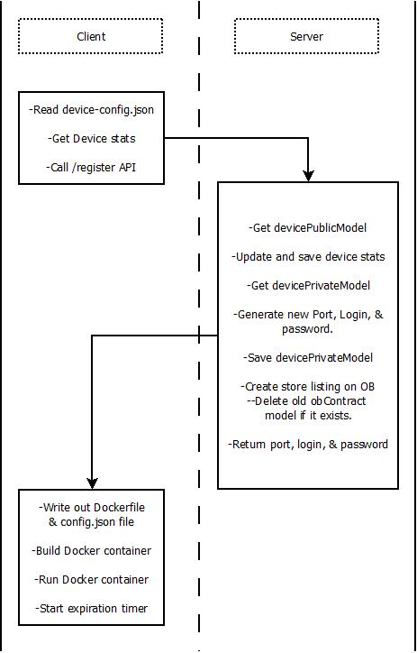
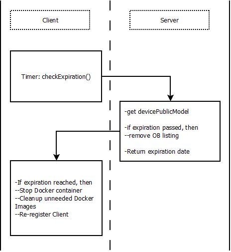

# Server Client Interactions #
This page documents the interactions between the Server and Client from the
perspective of API calls and the program workflow.
The purpose of this documentation is to give visual
aids and specifications to help programmers understand the code.

## Client-Registration
The first, most basic workflow is client registration. This is where the client
device connects to the server, sets up it's Docker shell, and the server adds
the client to marketplace of available devices for rent.

## Check-Expiration
The client device governor (`p2p-vps-client.js`) will periodically reach out to
the server to check its expiration date.
When the client device has reached it's expiration, it will destroy the current
Docker container and wipe any persistent storage. It will then re-register
with the server by going through the [client registration](#client-registration)
workflow above.

## Client-Check-In
The `connect-client.js` application running inside the Client Docker container is
responsible for establishing a reverse SSH connection with the server. It is also
responsible for sending a heart beat (or check-in signal) to the server to indicate
that it is connected to the network, and the software inside the Docker container
is running correctly.

