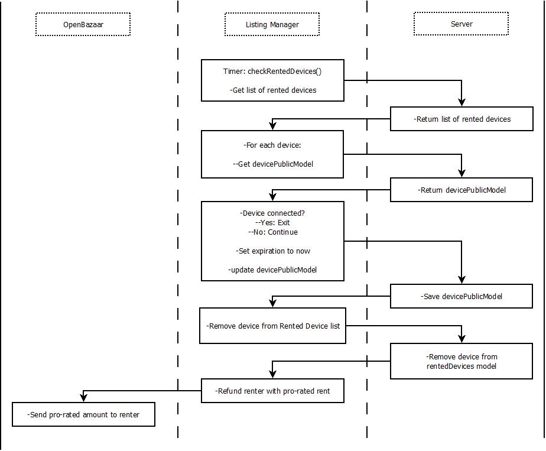

# Listing Manager #
The Listing Manager is a node application included in the
[server deployment](https://github.com/P2PVPS/server-deployment) repository.
This application is responsible for managing the OpenBazaar store by adding
new listings, removing invalid listings, and fulfil new orders as they come in.
This document describes the different workflows between the Listing Manager,
the server, and the OpenBazaar store.

## Fulfill-Orders
This is the primary task of the Listing Manager. It periodically polls the OpenBazaar
store for new order notifications. If one is detected, the Listing Manager adds the
login, password, and port information to the order and then marks it as Fulfilled.

## Delist-Disconnected-Clients
If a *client listed for rent on the OpenBazaar store* fails to check in with the
server after some grace period, it must
be considered in a disconnected state. The Listing Manager then removes the
rental listing from the OpenBazaar store.

## Detect-And-Refund-Disconnected-Rentals
If a *client that is actively being rented* fails to check in with the server after
some grace period, it must be considered in a disconnected state. The Listing Manager
resets the device (when it comes online) by manipulating the expiration date. It also
needs to automatically generate a pro-rated refund to the renter.

## Fulfill-Renewals
In addition to polling the OpenBazaar store for new rental orders, the Listing
Manager also needs to poll purchases of renewal contracts. This allows renters
to renew the rental agreement and continue using the rented Client.

**Diagram Here**

## Remove-Orphaned-Renewals
If a renewal listing hangs out on the OpenBazaar store for more than hour, it
is considered 'orphaned'. In this case, the Listing Manager needs to remove that
listing from the OpenBazaar store.

**Diagram Here**
